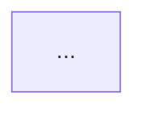

# Mermaid Diagrams

Create readable, valid Mermaid diagrams through a structured process. Every diagram must
pass syntax validation before being written to any file or spec.

## Process

Follow in order. Do not skip steps.

### 1. Describe in text first

Before writing any Mermaid syntax, write 2–4 sentences answering:
- What does this diagram show?
- Who is the audience (developer, PM, architect)?
- What is the level of abstraction (system / container / component / code)?
- What is explicitly out of scope?

This prevents diagrams that are technically valid but communicate nothing.

### 2. Choose diagram type

Use this table. If confidence is below 90% — ask the user.

| What you need to show | Type | Do NOT use |
|---|---|---|
| System/container/component architecture | `flowchart` + `subgraph` | C4Context, C4Container |
| Data flow, business process, decision tree | `flowchart TD` or `LR` | sequence for timeless flows |
| Time-ordered interactions (API, NFC, async) | `sequenceDiagram` | flowchart for temporal flows |
| State machine, lifecycle | `stateDiagram-v2` | flowchart with self-loops |
| Domain model, DB schema | `erDiagram` | classDiagram without methods |
| OO model with methods | `classDiagram` | erDiagram for OO models |

**C4 is banned.** Mermaid's C4 renderer produces overlapping labels and broken boundaries.
Use `flowchart` + `subgraph` instead — see the C4 mapping section below.

### 3. Write the draft

- Use short Latin IDs for nodes: `App`, `SDK`, `Card`, `API_v1`
- Put all display text in labels: `App["Mobile App"]`
- Wrap any label containing spaces, special chars, or punctuation in double quotes
- Keep it simple: aim for ≤15 nodes per diagram
- Start with the happy path; add error branches only if essential

### 4. Validate

Run before writing to any file:

```bash
~/.agents/skills/mermaid-diagrams/scripts/validate.sh path/to/diagram.mmd
```

- Exit 0 → proceed
- Exit 1 → parse error with line number → fix and re-validate
- Exit 2 → network error → warn the user, ask permission to skip (risk: broken diagram in spec)

**Writing an invalid diagram to a spec is not allowed.**

### 5. Check complexity

If the diagram has >15 nodes or >3 levels of subgraph nesting — split it.
Each diagram should answer exactly one question. Two focused diagrams beat one sprawling one.

### 6. Insert into document

Wrap in a fenced code block:

````

````

Add a one-sentence caption above the block describing what it shows.

---

## Syntax rules

### Special characters

Any label containing `()[]{}/<>\/&#` or spaces must be in double quotes:

```
%% WRONG
A[My service (v2)] --> B

%% OK
A["My service (v2)"] --> B
```

### Reserved word `end`

`end` closes blocks (`subgraph`, `alt`, `loop`, etc.). Quote it when used as a label:

```
%% WRONG
start --> end

%% OK
start --> "end"
```

### Node IDs

Only `[A-Za-z0-9_]`. No spaces, no Cyrillic, no dashes in IDs.
Display text goes in the label part `[...]`.

### Line breaks

- **flowchart**: use markdown strings (backtick syntax) or just remove the line break:
  ```
  %% WRONG — \n renders as literal text
  A["Tangem App\n(iOS / Android)"]

  %% OK — markdown string with real newline
  A["`Tangem App
  (iOS / Android)`"]

  %% OK — simplest, just use a space
  A["Tangem App (iOS / Android)"]
  ```
- **sequenceDiagram**: use `<br/>` in message text.
- `\n` and `<br/>` both render as literal text in flowchart node labels — never use them.

### Comments

`%%` must be on its own line. Never put `{}` inside a `%%` comment — it triggers the directive parser.

### Edge labels with special characters

```
%% WRONG
A -->|POST /api/sign| B

%% OK
A -->|"POST /api/sign"| B
```

---

## C4 → flowchart mapping

| C4 concept | flowchart equivalent |
|---|---|
| `Person` | node with `actor` classDef or `([...])` shape |
| `System_Ext` | node outside subgraph, `external` classDef |
| `System` | node inside top-level subgraph, `system` classDef |
| `Container_Boundary` | `subgraph` with quoted label |
| `Container` | node inside subgraph |
| `Rel` | labeled edge `-->|"label"|` |

Minimal classDef palette:

```
classDef external fill:#f5f5f5,stroke:#aaa,color:#333
classDef system   fill:#dae8fc,stroke:#6c8ebf
classDef backend  fill:#d5e8d4,stroke:#82b366
classDef card     fill:#fff2cc,stroke:#d6b656
```

See `references/templates.md` → Template 4 for a full worked example.

---

## Complexity budget

| Metric | Limit | Action if exceeded |
|---|---|---|
| Nodes per diagram | 15 | Split into multiple diagrams |
| Subgraph nesting depth | 3 | Flatten or extract inner subgraph |
| Sequence participants | 6 | Split by subsystem |
| State machine states | 12 | Extract composite states |

---

## References

- `references/syntax-by-type.md` — full syntax for each diagram type (flowchart, sequenceDiagram, stateDiagram-v2, erDiagram, classDiagram)
- `references/pitfalls.md` — 12 common parse errors with fixes
- `references/templates.md` — 5 validated Tangem templates (NFC handshake, signing flow, wallet lifecycle, architecture, domain model)
- `scripts/validate.sh` — validation script (requires `curl`, internet access)
