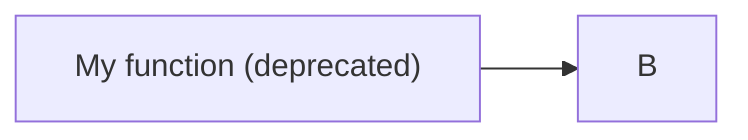
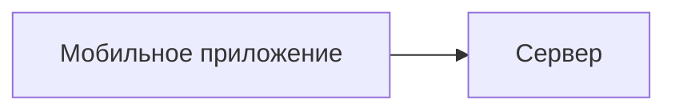
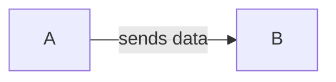
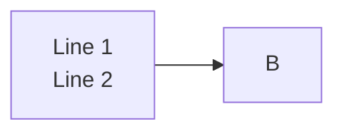
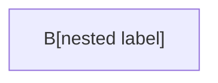
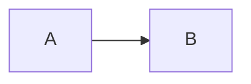

# Mermaid Parser Pitfalls and Fixes

Each entry: **symptom → cause → fix** with code example.

---

## 1. Parentheses in node label

**Symptom:** `Parse error on line N: ... got 'PS'`

**Cause:** `()` inside `[...]` is interpreted as a node shape modifier.

```mermaid
%% BROKEN
flowchart LR
    A[My function (deprecated)] --> B
```

**Fix:** Wrap label in double quotes.



---

## 2. Reserved keyword `end`

**Symptom:** Diagram cuts off or renders incorrectly after a node named `end`.

**Cause:** `end` closes `subgraph`, `alt`, `loop`, `opt`, `par` blocks.

```mermaid
%% BROKEN
flowchart LR
    start --> end
```

**Fix:** Quote it or rename.

```mermaid
%% OK
flowchart LR
    start --> "end"
```

---

## 3. Cyrillic or spaces in node IDs

**Symptom:** `Parse error` or silent rendering failure.

**Cause:** Node IDs (the part before `[...]`) must be alphanumeric + underscore only.

```mermaid
%% BROKEN
flowchart LR
    Мобильное приложение --> Сервер
```

**Fix:** Use Latin IDs, put display text in labels.



---

## 4. Arrow touching text without space

**Symptom:** Parse error on the edge line.

**Cause:** `-->text` is not valid; label requires `|...|` syntax.

```mermaid
%% BROKEN
flowchart LR
    A -->sends data B
```

**Fix:** Use `|label|` or add proper spacing.



---

## 5. `<br/>` in flowchart node labels

**Symptom:** `<br/>` renders as literal text in flowchart nodes.

**Cause:** flowchart nodes don't process HTML tags in regular `[...]` labels.



**Fix:** Use markdown strings (backtick syntax) with actual newline.


Note: `<br/>` **does** work in `sequenceDiagram` messages and notes.

---

## 6. Nested shapes without quotes

**Symptom:** Parse error or garbled output.

**Cause:** `A[B[nested]]` confuses the parser — it sees two opening brackets.

```mermaid
%% BROKEN
flowchart LR
    A[B[nested label]]
```

**Fix:** Quote the label.



---

## 7. `%%{}%%` in comments

**Symptom:** Diagram fails to render entirely.

**Cause:** `%%{...}%%` is the directive syntax. Using `{}` inside a `%%` comment triggers the directive parser.



**Fix:** Avoid `{}` inside `%%` comments.


---

## 8. Subgraph label with special characters

**Symptom:** Parse error on the `subgraph` line.

**Cause:** Unquoted subgraph labels with spaces, dashes, or brackets break parsing.

```mermaid
%% BROKEN
subgraph Internet Banking System
    A --> B
end
```

**Fix:** Quote the label.

```mermaid
%% OK
subgraph IBS["Internet Banking System"]
    A --> B
end
```

---

## 9. Edge label with special characters

**Symptom:** Parse error on the edge line.

**Cause:** Characters like `(`, `)`, `/`, `#` in `|label|` break the parser.

```mermaid
%% BROKEN
A -->|POST /api/v1/sign| B
```

**Fix:** Quote the edge label.

```mermaid
%% OK
A -->|"POST /api/v1/sign"| B
```

---

## 10. Diagram too wide / unreadable

**Symptom:** Nodes overlap, text truncated, diagram is a wall of boxes.

**Cause:** Too many nodes in one diagram (>15) or deeply nested subgraphs (>3 levels).

**Fix:** Split into multiple diagrams. Each diagram should answer one question.

- System overview → one flowchart (high-level boxes only)
- Single flow detail → separate sequenceDiagram or flowchart
- State machine → separate stateDiagram-v2

---

## 11. `classDef` not applying to subgraph nodes

**Symptom:** Nodes inside subgraph ignore `classDef` styling.

**Cause:** `class` assignment must reference the node ID, not the subgraph ID.

```mermaid
%% BROKEN — assigns style to subgraph, not nodes
classDef highlight fill:#ff0
class MySubgraph highlight
```

**Fix:** Assign `class` to individual node IDs.

```mermaid
%% OK
classDef highlight fill:#ff0
class NodeA,NodeB highlight
```

---

## 12. `stateDiagram-v2` note syntax

**Symptom:** Note block causes parse error.

**Cause:** Notes in stateDiagram-v2 require `end note` to close, not just `end`.

```mermaid
%% BROKEN
note right of Active
    Card is ready
end
```

**Fix:** Use `end note`.

```mermaid
%% OK
note right of Active
    Card is ready
end note
```

---

## 13. `\n` in flowchart node labels

**Symptom:** Label renders with a literal `\n` in the text, e.g. `Tangem App\n(iOS / Android)`.

**Cause:** Flowchart node labels don't interpret `\n` as a line break — it's treated as two characters: backslash and `n`.

```mermaid
%% BROKEN — \n shows as literal text
flowchart LR
    App["Tangem App\n(iOS / Android)"] --> SDK
```

**Fix option 1:** Remove the line break — put everything on one line.

```mermaid
%% OK
flowchart LR
    App["Tangem App (iOS / Android)"] --> SDK
```

**Fix option 2:** Use a markdown string with a real newline (backtick syntax).

```mermaid
%% OK
flowchart LR
    App["`Tangem App
    (iOS / Android)`"] --> SDK
```

Note: `<br/>` has the same problem — it also renders as literal text in flowchart labels. Only works in `sequenceDiagram` messages.
