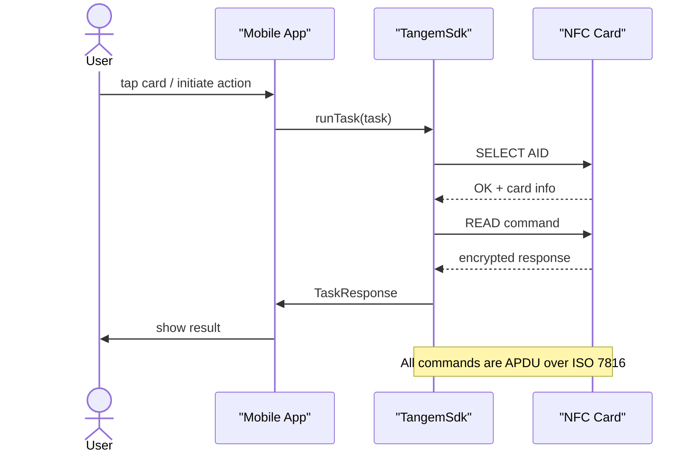
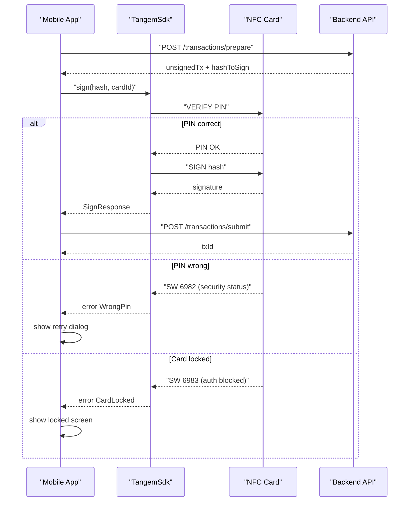
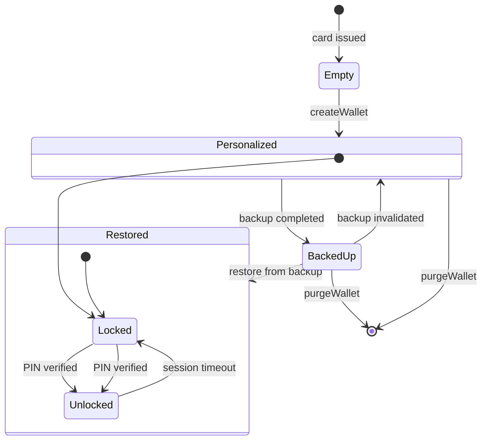
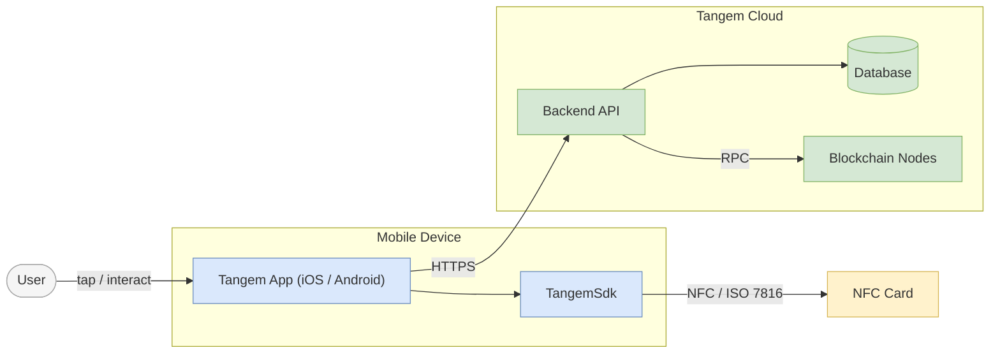
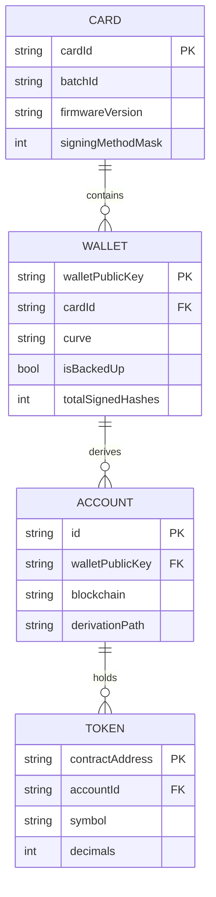

# Mermaid Templates for Tangem

All templates are validated. Replace `%%` comments with actual values.

---

## 1. NFC Card ↔ Phone Handshake (sequenceDiagram)

Use for: NFC session establishment, card command exchange, session teardown.

---

## 2. Transaction Signing Flow (sequenceDiagram with alt)

Use for: sign transaction, sign hash, any operation requiring PIN or biometrics.

---

## 3. Wallet Lifecycle (stateDiagram-v2)

Use for: card/wallet state machine, lifecycle documentation.

---

## 4. Card-Phone-Backend Architecture (flowchart replacing C4)

Use for: system/container-level architecture overview. Replaces C4Context / C4Container.

---

## 5. Domain Model: Accounts, Wallets, Tokens (erDiagram)

Use for: domain model documentation, data structure overview.

